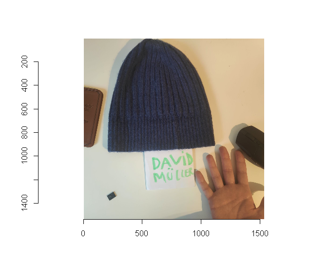
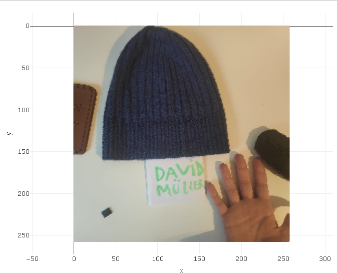
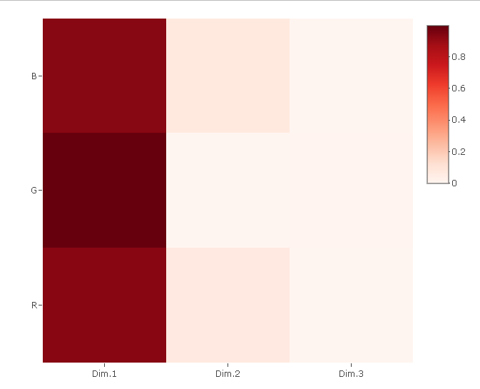
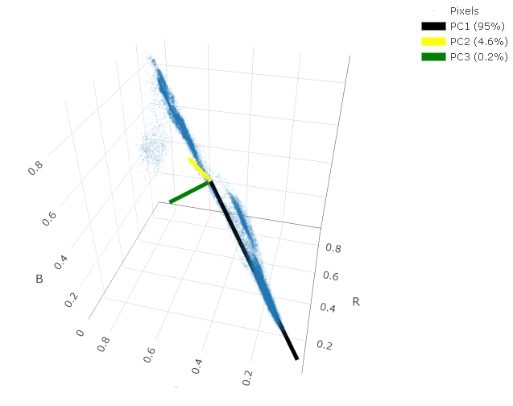
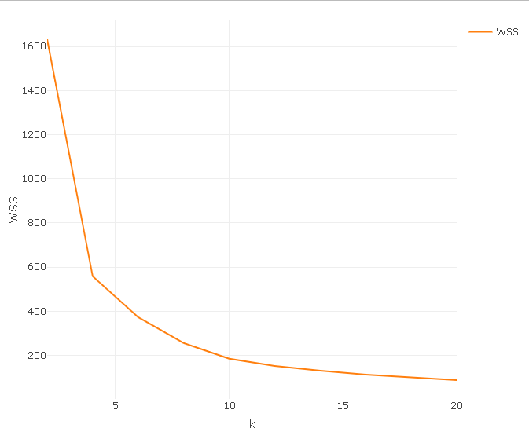
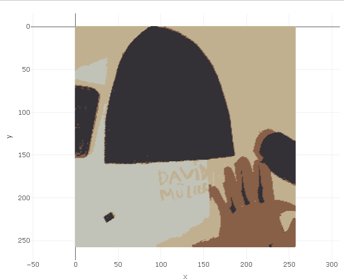
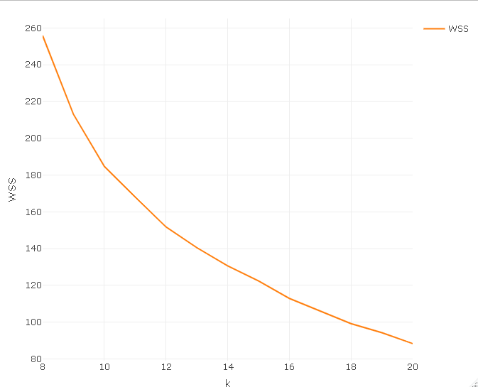
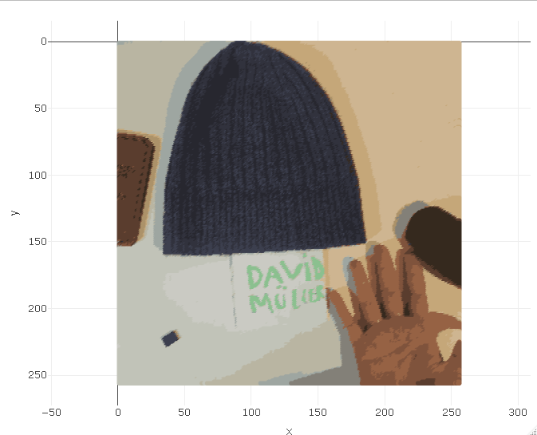

# Image Color Quantization and Clustering Analysis

This report outlines the process of reducing the color palette of an image using K-Means clustering and Principal Component Analysis (PCA). 

## 1. Preprocessing

Here is the original image. The first step in the process is to resize it to make computation more manageable.


<br>


After resizing, the processing begins by converting the image into a set of data points, extracting the unique colors, and renaming them to RGB values.

```text
       R         G         B     N
           <num>     <num>     <num> <int>
    1: 0.6666667 0.6470588 0.5725490     1
    2: 0.7411765 0.6941176 0.6313725     1
    3: 0.7411765 0.6941176 0.6078431     1
    4: 0.6784314 0.6705882 0.6235294     1
    5: 0.6627451 0.6784314 0.6196078     1
   ---                                    
13034: 0.8039216 0.7019608 0.5568627   535
13035: 0.7960784 0.6941176 0.5490196   636
13036: 0.8078431 0.7058824 0.5686275   706
13037: 0.8156863 0.7215686 0.5803922   755
13038: 0.7647059 0.7764706 0.7411765   984
```

**Result:** `13,038` unique colors out of a total of `65,536` pixels. 
From my understanding, this is mostly to show how much compute power you will need when deciding on the `K` value and calculating the resulting image.

## 2. Principal Component Analysis (PCA)

Next, we look at the importance of components:

```text
Importance of components:
                          PC1     PC2     PC3
Standard deviation     1.6895 0.37154 0.08663
Proportion of Variance 0.9515 0.04601 0.00250
Cumulative Proportion  0.9515 0.99750 1.00000
```

Here we can see that most of the components can be described in a single line, and almost all with 2 lines (dimensions), which indicates the `K` value should be somewhat low.

### Visualizing PCA
Below is the visual presentation of the importance of components via a Heatmap and in a 3D space.


<br>


## 3. Deciding the K Value

Now the tricky part. In the previous parts, we could estimate the range of `K` that will be needed and the processing power required.

First, I ran from `K = 2` to `40` (in increments of 2) at `nstart = 100`. The 100 was needed because I noticed noticeable differences on multiple runs. After determining that the largest elbow happens in the range of `2-10`, I ran it again at an increment of 1 in that specific range.



Here we can see a clear elbow at `K = 4`, so I chose `K = 4` and processed the image with the same `nstart = 100` to avoid issues.

### First Output (K = 4)



As we can see here, it's clearly a bad result. You can see the silhouette of the objects and the name is blending with the background, but the objects aren't recognizable.

## 4. Refining K based on Manual Analysis

Because of the poor result at `K = 4`, I chose to approach it another way. I manually counted the main colors myself (I found 11) and did a new `K` search slightly below this number and a lot larger (`8-20`), using the same increment and same `nstart`.



Here, the only elbow-ish part is at `K = 16`. Up until 16, the angle gradually reduces, but at 16 it creates a slightly sharper slope and then continues the previous slope angle.

## 5. Final Result



Here is the final result using `K = 16`. Everything is visible; the hand shadow looks a bit weird, but this image looks highly usable. 

While I'm sure if I reduced the `K` value manually I could find the absolute minimal `K` that shows all the necessary details, doing so would go against the parameters of the assignment.

# Conclusion: Honestly, if it wasnt asked to find the elbow I would have just started at a estimated number of colors and multiplying it by a certain amount and manually check each K and reduce until the important data starts dissapearing.
